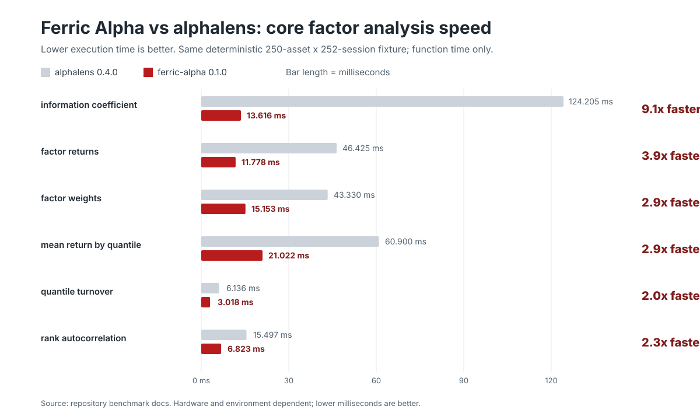

# Ferric Alpha

Ferric Alpha is a high-performance Rust implementation of factor analysis
workflows inspired by alphalens. It uses Polars as its core table engine and
provides both Rust and Python APIs.

The project is in pre-alpha. The `0.1.x` releases are intended for early
factor research, API feedback, and compatibility validation.

## Current scope

Ferric Alpha currently supports factor data preparation, core performance
metrics, turnover and portfolio series, serializable tear-sheet data, and
native report rendering.

## Performance

The benchmark below compares the Python-facing `ferric-alpha` API with
`alphalens` on the same deterministic long/short factor fixture. It measures
function execution time only; fixture construction is outside the timed block.

Benchmark setup:

- Machine: Apple silicon macOS `26.3.1`
- Dataset: `250` assets, `252` sessions, `63,000` factor rows
- Forward returns: `1D` and `5D`
- Iterations: `5`; result is median wall-clock time
- Rank autocorrelation recheck: median of `7` runs, `15` iterations per run
- `ferric-alpha`: `0.1.0`, release build, Python `3.13.4`, Polars `1.42.1`
- `alphalens`: `0.4.0`, Python `3.9.25`, Pandas `1.5.3`, NumPy `1.23.5`



Results where `ferric-alpha` is faster:

| Metric | ferric-alpha | alphalens | Result |
| --- | ---: | ---: | ---: |
| `factor_information_coefficient` | `13.616 ms` | `124.205 ms` | `9.1x` |
| `factor_returns` | `11.778 ms` | `46.425 ms` | `3.9x` |
| `factor_weights` | `15.153 ms` | `43.330 ms` | `2.9x` |
| `mean_return_by_quantile` | `21.022 ms` | `60.900 ms` | `2.9x` |
| `quantile_turnover` | `3.018 ms` | `6.136 ms` | `2.0x` |
| `factor_rank_autocorrelation` | `6.823 ms` | `15.497 ms` | `2.3x` |

`factor_rank_autocorrelation` automatically uses a dense matrix for complete
date-by-asset panels and retains the compatibility path for sparse or changing
universes. A direct alphalens oracle comparison over shuffled data with ties
and lags `1`, `3`, and `10` matched null positions exactly; the maximum absolute
numeric difference was `1.11e-16`.

Reproduce the benchmark from this repository:

```bash
.venv/bin/maturin develop --release
.venv/bin/python scripts/benchmark_alphalens_comparison.py --engine ferric

python3.9 -m venv /tmp/alphalens-bench
/tmp/alphalens-bench/bin/python -m pip install \
  'alphalens==0.4.0' 'pandas==1.5.3' 'numpy==1.23.5' \
  'scipy==1.10.1' 'statsmodels==0.13.5' 'empyrical==0.5.5'
PYTHONWARNINGS=ignore /tmp/alphalens-bench/bin/python \
  scripts/benchmark_alphalens_comparison.py --engine alphalens
```

## Data model

Core APIs use explicit long-form columns such as `date`, `asset`, and `factor`.
They do not emulate Pandas `MultiIndex` behavior.

Required columns:

- `date`: Polars `Datetime`
- `asset`: Polars `String`
- `factor`: Polars `Float64`; null values are preserved

The optional `group` column must be Polars `String`. The `(date, asset)` key
must be non-null and unique.

## Quickstart

Run the complete factor-analysis example after building from source:

```bash
python examples/factor_quickstart.py --output-dir quickstart-output
```

It prepares a known-signal dataset, computes IC, quantile returns, factor
returns, alpha/beta, turnover, and rank autocorrelation, then writes a native
HTML tear sheet. See the [factor analysis quickstart](docs/quickstart.md) for
the input schema and an API walkthrough.

## Development

Prerequisites are Python 3.10 or newer, Rust 1.91 or newer, and `make`.

Create the local environment and build the extension:

```bash
make develop
```

Run all formatting checks, linters, Rust tests, and Python tests:

```bash
make verify
```

The Python package has Polars as its only default runtime dependency.

```python
import ferric_alpha

validated = ferric_alpha.validate_factor_frame(factor_frame)
```

## Rendering

Native HTML is the default plotting path and does not require Matplotlib,
Pandas, Seaborn, SciPy, or Statsmodels.

```python
import ferric_alpha as fa

report = fa.tears.create_full_tear_sheet_data(factor_data)
rendered = fa.plotting.render(report)
rendered.save("factor-report.html")
```

Native SVG and PNG are available directly:

```python
svg = fa.plotting.render_svg(report)
png = fa.plotting.render_png(report)
```

Notebook display uses the same native HTML object:

```python
fa.plotting.display(report)
```

The optional Matplotlib backend is installed separately:

```bash
pip install 'ferric-alpha[plot]'
```

```python
figure = fa.plotting.render(report, backend="matplotlib")
figure.savefig("factor-report.png", dpi=144)
```

The Matplotlib backend returns a `matplotlib.figure.Figure` and never calls
`show()` implicitly.

## License

Ferric Alpha is available under the Zero-Clause BSD (`0BSD`) license.
